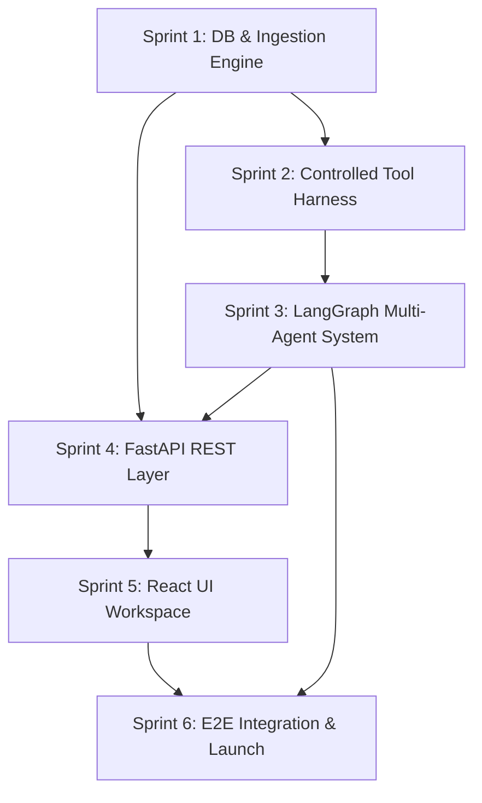

# Software Development Plan & Implementation Roadmap

## Project: Nexora — Autonomous AI for Evidence-Based Data Intelligence
**Document Version:** 1.0.0  
**Status:** Approved Engineering Roadmap  
**Target Release:** MVP (Phase 1)  
**Author:** Nexora Engineering Management & Lead Architecture  
**Last Updated:** October 2026  

---

## 1. Executive Overview & Development Philosophy

This document converts the **PRD**, **SRS Requirements**, **System Architecture**, and **UI/UX Specifications** into an actionable, sprint-by-sprint development roadmap for **Nexora**.

The implementation strategy adheres to four core engineering rules:
1. **Engine Before Interface:** Build and validate the controlled Python statistical tools and LangGraph multi-agent orchestration before building the frontend.
2. **Zero-Hallucination Testing:** Maintain a continuous evaluation suite that verifies all LLM-reported numbers directly against raw Python tool return payloads.
3. **Modular Contracts:** Enforce strict Pydantic v2 schemas for all inter-module communication (Agent $\leftrightarrow$ Tool, Backend $\leftrightarrow$ Frontend via WebSockets).
4. **Iterative Deployability:** Every two-week sprint produces a fully runnable, containerized artifact.

---

## 2. Project Milestones & High-Level Timeline

```
┌─────────────────────────────────────────────────────────────────────────────┐
│                       NEXORA 12-WEEK MVP ROADMAP                            │
├──────────────┬──────────────┬──────────────┬──────────────┬─────────────────┤
│ Weeks 1 - 2  │ Weeks 3 - 4  │ Weeks 5 - 6  │ Weeks 7 - 8  │ Weeks 9 - 10    │ Weeks 11 - 12
│ Sprint 1     │ Sprint 2     │ Sprint 3     │ Sprint 4     │ Sprint 5        │ Sprint 6
├──────────────┼──────────────┼──────────────┼──────────────┼─────────────────┤
│ Foundation,  │ Controlled   │ LangGraph    │ FastAPI      │ React / TS      │ E2E Testing,
│ Ingestion &  │ Python Tools │ Multi-Agent  │ Backend &    │ Workspace &     │ Evaluation &
│ DB Schema    │ & Test Suite │ Orchestration│ WebSockets   │ Visualizations  │ Docker Launch
└──────────────┴──────────────┴──────────────┴──────────────┴─────────────────┘
```

| Milestone | Target Sprint | Deliverables | Exit Criteria |
| :--- | :--- | :--- | :--- |
| **M1: Core Engine & Data Profiler** | Sprint 1 (W1–W2) | Ingestion pipeline, CSV/XLSX parser, Data Quality profiler, PostgreSQL schema. | 100k row CSV parsed and profiled in $<4\text{s}$; DB migrations pass. |
| **M2: Controlled Tool Harness** | Sprint 2 (W3–W4) | Descriptive, grouping, trend, and hypothesis testing Python tools with Pydantic validation. | 100% unit test coverage for math tools; zero external network access. |
| **M3: Agentic Intelligence Loop** | Sprint 3 (W5–W6) | LangGraph StateGraph, Supervisor Agent, Sub-agents, and LLM provider abstraction. | Multi-agent graph executes 10 benchmark queries autonomously. |
| **M4: Streaming Backend Hub** | Sprint 4 (W7–W8) | FastAPI endpoints, WebSocket event hub, Redis pub/sub, JWT authentication. | Real-time WebSocket streaming of agent thoughts and tool results. |
| **M5: Interactive UI Workspace** | Sprint 5 (W9–W10) | React 18, Vite, Tailwind CSS, shadcn/ui, Recharts charting, triple-pane workspace. | UI renders live agent timeline, responsive charts, and evidence cards. |
| **M6: MVP Production Launch** | Sprint 6 (W11–W12) | Docker Compose bundle, end-to-end evaluation, PDF export, zero-hallucination sign-off. | Passes 100% of acceptance criteria; automated CI/CD pipeline green. |

---

## 3. Work Breakdown Structure (WBS) & Task Dependencies



---

## 4. Sprint-by-Sprint Execution Plan

### Sprint 1: Project Setup, Data Ingestion & Storage Subsystem (Weeks 1–2)
* **Goal:** Establish monorepo structure, containerized PostgreSQL/Redis environment, and high-performance tabular ingestion engine.
* **Tasks:**
  1. Initialize monorepo directory layout (`/backend`, `/frontend`, `/document`, `/scripts`).
  2. Setup Docker Compose configuration for PostgreSQL 16 and Redis 7.
  3. Implement SQLAlchemy 2.0 async database models (`Workspace`, `Dataset`, `AnalysisSession`, `AgentStep`, `AnalysisReport`).
  4. Create Alembic migration scripts and establish initial schema baseline.
  5. Build `DataIngestor` module supporting `.csv` and `.xlsx` with automatic delimiter/encoding detection (`chardet`).
  6. Build `DataQualityProfiler` calculating missing values, duplicates, column cardinality, memory usage, and Health Score (0–100%).
* **Deliverable:** Working Python service that ingests 50MB CSV files, profiles quality, and persists metadata in PostgreSQL.

### Sprint 2: Controlled Python Data Science Tools (Weeks 3–4)
* **Goal:** Build and mathematically verify the deterministic Python tool library.
* **Tasks:**
  1. Define Pydantic v2 schemas for all tool input arguments and standardized `ToolExecutionResult` outputs.
  2. Implement `DescriptiveStatisticsTool` (mean, median, std, skewness, kurtosis, quartiles).
  3. Implement `GroupAnalysisTool` (multi-column group aggregations with sum, mean, count, min, max).
  4. Implement `TrendAnalysisTool` (time-series resampled aggregations: daily, weekly, monthly, quarterly).
  5. Implement `StatisticalTestingTool`:
     * Independent and paired two-sample $t$-tests (`scipy.stats.ttest_ind`).
     * Chi-square test of independence (`scipy.stats.chi2_contingency`).
     * One-way ANOVA (`scipy.stats.f_oneway`).
     * Pearson and Spearman correlation matrices.
  6. Implement `ChartSpecTool` producing declarative JSON chart definitions for Recharts.
  7. Develop comprehensive unit test suite comparing tool outputs against verified R / SciPy baselines.
* **Deliverable:** 100% verified, pure Python tool library with zero arbitrary code execution risk.

### Sprint 3: LangGraph Multi-Agent Orchestration & Prompts (Weeks 5–6)
* **Goal:** Implement the stateful multi-agent analytical loop using LangGraph and LangChain.
* **Tasks:**
  1. Define global `NexoraAnalysisState` TypedDict schema.
  2. Configure provider-agnostic LLM interface (supporting OpenAI GPT-4o, Anthropic Claude 3.5 Sonnet, Google Gemini 1.5 Pro).
  3. Build `SupervisorAgent` responsible for question decomposition and dynamic `AnalysisPlan` creation.
  4. Build specialized sub-agents:
     * `DataUnderstandingAgent` (schema & column mapping).
     * `DataQualityAgent` (anomaly & outlier validation).
     * `EDAAgent` (exploratory query formulation).
     * `StatisticalAgent` (hypothesis test selection & tool execution).
     * `VisualizationAgent` (visual encoding selection).
     * `InsightAgent` (evidence synthesis with strict numeric citation).
     * `RecommendationAgent` (actionable business next steps).
  5. Implement LangGraph conditional edges and feedback loops for tool retry and self-correction.
  6. Enforce prompt-level and schema-level guardrails preventing math hallucination and causal fallacies.
* **Deliverable:** Standalone CLI/test script executing full multi-agent investigative queries against sample datasets.

### Sprint 4: FastAPI REST API & WebSocket Streaming Hub (Weeks 7–8)
* **Goal:** Wrap the engine in a high-performance asynchronous API with real-time streaming capabilities.
* **Tasks:**
  1. Build JWT authentication routes (`/api/v1/auth/login`, `/register`, `/me`).
  2. Build Dataset management endpoints (`/api/v1/datasets/upload`, `/list`, `/{id}/profile`, `/{id}/delete`).
  3. Build Analysis endpoints (`/api/v1/analysis/start`, `/{id}/status`, `/{id}/report`).
  4. Build WebSocket connection manager (`/ws/analysis/{session_id}`) with Redis Pub/Sub integration.
  5. Hook LangGraph event callbacks directly into WebSocket emitters (`PLAN_CREATED`, `AGENT_STEP`, `TOOL_EXECUTED`, `INSIGHT_EMITTED`, `ANALYSIS_COMPLETE`).
  6. Implement background task queue for dataset cleanup and long-running report compilations.
  7. Add structured JSON request logging and Prometheus metrics endpoint (`/metrics`).
* **Deliverable:** Fully functional backend server with documented Swagger UI (`/docs`) and streaming WebSocket support.

### Sprint 5: Modern React/TypeScript Frontend Workspace (Weeks 9–10)
* **Goal:** Deliver the responsive, dark-mode web application implementing the UI/UX specifications.
* **Tasks:**
  1. Initialize React 18 + Vite + TypeScript application with Tailwind CSS and shadcn/ui.
  2. Configure Zustand stores for active session, dataset state, and UI theme.
  3. Build Navigation Shell (Sidebar, Header, Dataset Switcher).
  4. Build `DatasetInspector` screen (Scorecard gauge, schema table, missing value visualizer).
  5. Build `AIAnalysisWorkspace` screen:
     * Natural-language `QueryInput` with auto-complete chips.
     * `AgentStepTimeline` rendering real-time streaming agent thought events.
     * `ChartCanvas` rendering responsive Recharts (Bar, Line, Scatter, Boxplot).
     * `EvidenceCard` component with expandable statistical proof drawer.
  6. Build `ReportView` screen with Markdown viewer and PDF download button.
  7. Implement WebSocket client hook (`useAnalysisStream`) with automatic reconnection logic.
* **Deliverable:** Highly polished, responsive web application connected to the backend.

### Sprint 6: End-to-End Integration, Evaluation & Launch (Weeks 11–12)
* **Goal:** Conduct end-to-end testing, zero-hallucination auditing, performance optimization, and containerized deployment.
* **Tasks:**
  1. Build PDF report generation service using Headless Chromium or WeasyPrint.
  2. Develop automated end-to-end evaluation suite (50 real-world business queries against 5 benchmark datasets).
  3. Audit calculation accuracy: Assert that 100% of figures reported in final insights match tool result values.
  4. Perform load testing with Locust (25 concurrent active user queries).
  5. Implement frontend E2E browser tests using Playwright.
  6. Finalize Caddy / Nginx reverse proxy and production Docker Compose configuration.
  7. Author production deployment guides, environment variable templates, and user quickstart documentation.
* **Deliverable:** Production-ready Nexora MVP platform release.

---

## 5. Definition of Done (DoD)

### 5.1 Story-Level DoD
* Code passes all pre-commit hooks (Black, Ruff, ESLint, TypeScript compiler check).
* Unit tests written and passing with $\ge 85\%$ test coverage on modified modules.
* Pydantic schemas validated with strict type checking.
* API endpoints documented in OpenAPI / Swagger schema.
* No hardcoded credentials or unhandled exceptions.

### 5.2 Sprint-Level DoD
* All committed features demonstrated successfully in a working integration environment.
* Zero critical or high-severity security vulnerabilities in dependencies (`safety check`, `npm audit`).
* Database migrations apply and roll back cleanly without data corruption.
* Pull requests reviewed and approved by at least two engineering peers.

### 5.3 Release-Level DoD (MVP Release)
* **Zero Math Hallucination Verification:** 100% match on evaluation benchmarks between LLM outputs and Python tool results.
* Performance criteria met: 100k row profiling $<4\text{s}$; query resolution $<30\text{s}$.
* Responsive design verified across desktop displays ($\ge 1024\text{px}$).
* One-click containerized deployment via `docker compose up --build`.

---

## 6. Risk Management & Contingency Plan

| Risk Description | Probability | Impact | Proactive Mitigation Strategy |
| :--- | :---: | :---: | :--- |
| **LLM Provider Outage or Rate Limit (429)** | Medium | High | Integrate LangChain multi-provider fallback. If primary provider (e.g. OpenAI) errors, failover automatically to Anthropic or Gemini. |
| **WebSocket Connection Drops during Analysis** | High | Medium | Store all agent events in Redis keyed by `session_id`. Upon client reconnection, stream full event history to reconstruct UI state. |
| **Complex Multi-Table Joins Requested by User** | Medium | Medium | Explicitly scope MVP to single-table datasets. Supervisor agent detects multi-table queries and gracefully explains single-dataset scope for Phase 1. |
| **Chart Rendering Overload on Large Point Counts** | High | Low | Controlled `ChartSpecTool` automatically downsamples or bins data points to a maximum of 500 points before returning JSON to frontend. |

---

## 7. Quality Assurance & Evaluation Framework

```
┌─────────────────────────────────────────────────────────────────────────────┐
│                           QA & VALIDATION SUITE                             │
├───────────────────────┬───────────────────────────┬─────────────────────────┤
│ UNIT & MATH TESTS     │ AGENT EVALUATION (EVALS)  │ PERFORMANCE & E2E       │
├───────────────────────┼───────────────────────────┼─────────────────────────┤
│ • Pytest (SciPy/R)    │ • 50 Benchmark Questions  │ • Playwright Browser    │
│ • Pydantic Validation │ • Tool Call Accuracy      │ • Locust Load Testing   │
│ • Jest/Vitest UI      │ • Hallucination Audit (0%)│ • Memory Profiling      │
└───────────────────────┴───────────────────────────┴─────────────────────────┘
```

1. **Deterministic Math Verifier:** Test suite `tests/tools/test_statistical_tools.py` benchmarks all hypothesis tests and correlations against established reference datasets with numerical assertions at $10^{-6}$ precision.
2. **Autonomous Agent Evals:** A dedicated evaluation harness executes standard business diagnostic scenarios (e.g., churn spike, sales slump, regional variance). Automated assertions verify:
   * Correct tools were selected.
   * Relevant target columns were inspected.
   * Reported $p$-values and means precisely match tool outputs.
3. **End-to-End Browser Tests:** Playwright tests simulate the full user journey: drag-and-drop CSV upload $\rightarrow$ profile inspection $\rightarrow$ prompt submission $\rightarrow$ live timeline observation $\rightarrow$ PDF report export.
